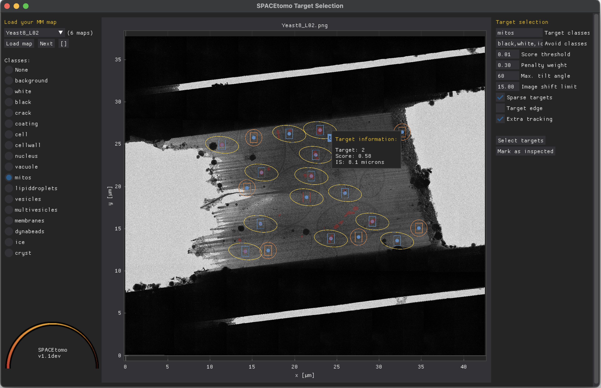

# SPACEtomo

Smart Parallel Automated Cryo Electron tomography (SPACEtomo) is a set of SerialEM and Python scripts to fully automate the cryoET data collection workflow.
Please refer to the [publication](#) for more details.


## Use cases

SPACEtomo allows for a variety of automation levels applicable to a range of samples.

- Automated whole grid montage acquisition, lamella detection and medium mag lamella montage collection is **sample independent** and can be run using a multigrid workflow.
- Automated target selection based on segmentation of biological classes in Yeast.
- Manual target selection using a userfriendly drag and drop user interface on any sample.

## Contents

- [Hardware](#hardware)
- [Requirements](#requirements)
- [Installation](#installation)
- [Usage](#usage)
	- [Preparation](#preparation)
	- [Settings](#settings)
	- [Run](#run)
	- [Target selection GUI](#target-selection-gui)
	- [Output](#output)
	- [External Processing](#external-processing)
- [Video tutorials](#video-tutorials)
- [Troubleshooting](#troubleshooting)
- [Recent changes](#recent-changes)
- [Training Data](#training-data)
- [Future plans](#future-plans)

## Hardware

SPACEtomo has only been tested on Thermo Scientic Krios instruments equipped with a Gatan K3 or K2 direct electron detector at this point although it should also work on other Thermo Scientific intstruments. A recent version of the open-source microscope control software [SerialEM](https://bio3d.colorado.edu/SerialEM/) should be installed and calibrated. It also requires the [PACEtomo](https://github.com/eisfabian/PACEtomo) scripts.

## Requirements

SPACEtomo does not require the installation of any stand-alone software. However, it does require SerialEM 4.1.8 or higher capable of running Python scripts.

You can run the following lines of code in a SerialEM script window to test if Python is configured correctly:
```python
#!Python
import serialem as sem
sem.OKBox("Python works!")
```
If you get an error message, please consult the [SerialEM website](https://bio3d.colorado.edu/SerialEM/hlp/html/about_scripts.htm#Python) on how to setup Python for SerialEM.

Additionally, you will require several Python modules. I highly recommend using the [miniconda](https://docs.conda.io/projects/miniconda/en/latest/) package manager. This will require network connection. Please contact your responsible IT specialist if it's possible to temporarily allow network connection or setup a proxy.

If everything goes well, you can install all dependencies by downloading the *SPACEenvironment.yaml* file and running the following line the Anaconda Prompt:

    conda env create -f <your path>\SPACEenvironment.yaml

This may take 10-20+ minutes to collect all the packages. If it fails or you are impatient you can install the packages manually step by step.

If you do not have a CUDA capable GPU in your SerialEM computer, you can install the "no GPU" environment to run SPACEtomo without deep learning functions and instead use an external machine for the GPU dependent computations.

    conda env create -f <your path>\SPACEenvironment_noGPU.yaml

If you run into trouble with your OS (e.g. Windows Server 2008 on a K2 PC), you can try to install the minimal environment:

    conda env create -f <your path>\SPACEenvironment_minimal.yaml

In these last two cases, you have to install the full environment on your external machine.

### Manual setup

<details>
  <summary>Details</summary>

Create a new environment using Python 3.9:

    conda create -n SerialEM_pytorch python=3.9
    conda activate SerialEM_pytorch

NOTE: If you are using a K2 computer using Windows Server 2008, you will have to use Python 3.6 and only install the minmal environment.

The next step is to install the deep learning framework [PyTorch](https://pytorch.org/get-started/locally/). This should be as simple as using the following command but please double check the [PyTorch installation instructions](https://pytorch.org/get-started/locally/) for your system!

    conda install pytorch torchvision pytorch-cuda=11.8 -c pytorch -c nvidia

Let's verify the installaion and check if PyTorch has access to your GPU.

From the command line type:

    python

Then enter:
```python
import torch
torch.cuda.is_available()
```
If the output is not `True`, you have some troubleshooting to do. In my case, for example, I could fix it by updating the nvidia driver on our K3 computer. [Here](https://github.com/pytorch/pytorch/blob/main/RELEASE.md#release-compatibility-matrix) is some info on PyToch and CUDA compatibility and [here](https://docs.nvidia.com/deploy/cuda-compatibility/) some info on CUDA and driver compatibility. Good luck!

The next step is to install the framework for the segmentation model [nnU-Net](https://www.nature.com/articles/s41592-020-01008-z):

    pip install nnunetv2

If you run into issues, [here](https://github.com/MIC-DKFZ/nnUNet/blob/master/documentation/installation_instructions.md) are their installation instructions.

For the lamella detection model we need [YOLOv8](https://docs.ultralytics.com/):

    pip install ultralytics

Finally, we need the [mrcfile](https://pypi.org/project/mrcfile/) package to read and write mrc files:

    pip install mrcfile

If you want to run any SPACEtomo GUI you will need [DearPyGUI](https://github.com/hoffstadt/DearPyGui):

    pip install dearpygui

</details>

### SerialEM Python path

With that, all dependencies should be ready to go!

To let SerialEM access this environment, we have to adjust the *SerialEM_properties.txt* file to include the Python path to our environment:

    PathToPython	3.9 	<your path>\envs\SerialEM_SPACEtomo

If you use conda, you can also find the full path to your Python environment by running ```conda env list``` in your Anaconda prompt window.


## Installation

To install SPACEtomo, simply download and unpack the repository on the PC running SerialEM, and make note of the path to the folder. This folder contains all scripts but still requires the deep learning models.
Download the [lamella detection model](https://doi.org/10.5281/zenodo.10360489) and the [lamella segmentation model (Yeast)](https://doi.org/10.5281/zenodo.10360540) and extract them into the *SPACEtomo* folder. You should now have a *XXX_yolo8.pt* file and a *model* folder with 5 subfolders in your *SPACEtomo* folder.

Copy the *SPACEtomo.py* script into a SerialEM script window and adjust the *SPACE_DIR* setting to the path of the *SPACEtomo* folder.
```python
SPACE_DIR = "X:\<your path>\SPACEtomo"
```

Copy the *SPACEtomo_postAction.py* script into another SerialEM script window.

You also need the [PACEtomo scripts](https://github.com/eisfabian/PACEtomo) (v1.7+) ready and working inside SerialEM. All tilt series acquisition steps are conducted by PACEtomo, so please setup up your scripts and Low Dose settings according to the PACEtomo documentation.

## Usage

The usage instructions for SPACEtomo assume that [PACEtomo](https://github.com/eisfabian/PACEtomo) is already able to run normally on your setup.

### Preparation

SPACEtomo requires the setup of at least 2 image states in the SerialEM navigator. 

- One image state for whole grid montages (LM maps), at a pixel size <400 nm/px (including binning).
- One Low Dose mode image state with a View magnification for lamella montages (MM maps), ideally at pixel sizes <2.2 nm/px and a defocus offset of 50-100 μm, as well as the desired Record settings for tilt series acquisition. The smaller the beam diameter in Record mode, the more targets can be selected per lamella.

Additionally, an intermediate magnification (IM) might be required to compensate for the coordinate shifts between the low mag and the View mag. This magnification should contain the lamella fully in the FOV when moving the stage to a position on the LM map and it should be fairly well aligned to the View mag.
<details>
	<summary>Details</summary>
When selecting and moving to a point on an LM map, then taking a View image, the selected point will most likely not be in the field of view. Usually, I find that point manually and use the <i>Navigator</i> > <i>Shift to Marker</i> function to adjust the coordinates. 
	
To automate this, SPACEtomo moves to a lamella found on the LM map and takes an image at IM that needs to fully contain the lamella despite the offset. It then runs the same lamella detection model and shifts the coordinates to the newly found lamella. The jump from the IM to the View magnification in your Low Dose image state should be minimal since no further compensation is applied. 
</details>

For optimal results, it is recommended to check or redo the "Mag IS Offsets" calibration for the relevant magnifications.

The "High-Defocus Mag" and especially the "High-Defocus IS" calibrations also help to keep a feature centered when switcing from *View* to *Record* state.

The magnifications I use are 82x for LM, 580x for IM and 4800x for MM.

If you intend to do a [coma-free alignment](https://bio3d.colorado.edu/SerialEM/hlp/html/menu_focus.htm#hid_focus_coma_by_ctf) and a [coma vs image shift calibration](https://bio3d.colorado.edu/SerialEM/hlp/html/menu_calibration.htm#hid_focustuning_comavs), this should be done prior to running SPACEtomo ideally on a carbon support foil grid.

<details>
    <summary>Further recomendations for SerialEM setup</summary>
    - In the Montage control panel, check *Treat as very sloppy montage* and *Assess multiple peaks with weights*.
    - In the Image alignment & Focus Panel, check *Center image shift on tilt axis* and set tilt axis offset as described in the [PACEtomo](https://github.com/eisfabian/PACEtomo) documentation.
    - Set both, Focus and Trial to offset 0.
    - Align shift between Record and View magnification.
</details>

### Settings

All settings are adjusted in the *SPACEtomo.py* script. They are categorized by automation level and settings beyond you chosen automation level will not be relevant.

The most important settings for the first setup that remain mostly unchanged from session to session are:

- ```SPACE_DIR```: Path to the SPACEtomo folder containing the models and scripts.

- ```WG_image_state```: Image state index used for LM map
- ```MM_image_state```: Image state index used for Low Dose mode tilt series acquisition.
- ```WG_offset_via_IM```: Use an intermediate magnification to keep track of lamella when switching image states.
- ```IM_mag_index```: The mag index (e.g. 10) of the intermediate magnification or the magnification itself (e.g. 580).
- ```aperture_control```: [Does SerialEM have control over the apertures](https://bio3d.colorado.edu/SerialEM/hlp/html/setting_up_serialem.htm#apertures)?
- ```objective_aperture```: Size of objective aperture to be inserted when leaving LM.

The settings that will typically change from run to run are:

- ```automation_level```: Level 1-5 from only taking the WG map to starting the PACEtomo batch acquisition.
- ```external_map_dir```: Shared folder when running the processing on an external machine ([see below](#external-inference)).
- ```grid_list```: List of autoloader slots to be imaged (comma-separated in []-brackets). If you want to run SPACEtomo on the currently loaded grid, enter ```0``` and provide a ```grid_default_name```.

- ```wait_for_inspection```: Pause SPACEtomo before acuiqistion until selected targets have been inspected using the [SPACEtomo target selection GUI](#target-selection-gui)
- ```manual_selection```: Skip segmentation step (for samples without trained model) and use [SPACEtomo target selection GUI](#target-selection-gui) for target selection (needs ```wait_for_insepction```).

- The ```target_list``` includes all classes of the segmentation that are targeted. Examples for all classes can be found [here](img/class_examples.png).
- The ```avoid_list``` includes all classes that should be avoided.
- The ```target_score_threshold``` can be adjusted to reduce the number of targets. The score is calculated from the overlap of the camera field of view with the segmented classes. The score is not linear, but ranges from 0 to 1, from no target area in the FOV to the FOV being completely covered. A desired class in the center of the camera is upweighted. Generally, larger targets (e.g. nucleus or cell) are more robust to higher thresholds. Classes to be avoided in the FOV can cause a negative score.
- ```sparse_targets``` is a useful target selection mode for small targets like mitos or vesicles. If set to ```False```, a rigid grid of points is used for initial target selection, which is more suited to large target areas.
- ```target_edge``` can be used to target the edges of a segmented class. This could be useful for membrane structure studies (e.g. NPCs).
- ```penalty_weight```: Factor to downweight the classes of the ```avoid_list``` relative to the classes of the ```target_list```.
- ```max_iterations```: Maximum number of iterations for the target setup optimization.
- If you want to add an extra target for the tracking tilt series that does not contain your desired class you can set ```extra_tracking = True```.

<details>
  <summary>There are additional settings that can be adjusted to improve the successrate on your particular sample and imaging conditions.</summary>
  
  - ```MM_padding_factor```: MM maps are padded by this factor compared to the lamella bounding box. This accounts for the coordinates being off center or the bounding box prediction being off.
  - ```MM_mean_threshold```: If the first View image of a lamella is below this threshold (black), the user will be prompted to manually adjust the position. Set to 0 to avoid a user prompt.
  - ```WG_montage_overlap```: Overlap between neighboring tiles of the LM map for stitching.
  - ```MM_montage_overlap```: Overlap between neighboring tiles of the MM map for stitching. Good stitching is especially important here for reliable target selection.
  - ```WG_detection_threshold```: YOLOv8 confidence threshold for considering a hit a lamella. Raise this value if you have a lot of false positives.
  - ```WG_distance_threshold```: Minimum distance [microns] between lamellae to not be considered a duplicate detection (only used when ```WG_offset_via_IM = True```).
  - ```max_tilt```: This is the maximum tilt angle during a tilt series. It is used to calculate target spacing without any beam overlap. You can use lower values if you don't care about high angle overlaps and rather have more targets.
  - ```save_plot```: Save plots of intermediate steps (mainly during target selection).

</details>

The *SPACEtomo_config.py* only needs adjustment when updating the deep learning models.

### Run

You can run SPACEtomo at different automation levels. It will stop after reaching the final automation level and will let you manually finish the setup if you desire.


#### Level 1: Lamella identification

* SPACEtomo will load a grid, collect a LM map of the whole grid and identify the positions of lamellae. Navigator points labeled "PL#" ("Preliminary Lamella") will be added by SerialEM. It will then take another image of a lamella at IM to adjust the stage coordinates accordingly and label the navigator point "FL#" ("Final Lamella"). If you stop at level 1, you can manually move to the identified lamella and decide where you want to collect a montage or select targets using [PACEtomo_selectTargets.py](https://github.com/eisfabian/PACEtomo/).

#### Level 2: Lamella montage collection

* This level includes collection of MM maps of each lamella (optionally include lamella identified as broken). You can then use these maps for manual target selection. Level 2 is organism independent and should be able to be used for any kind of lamella sample.

#### Level 3: Feature identification

* Level 3 includes the subsequent segmentation of the lamella montages for manual inspection. This model is organism specific (only Yeast at time of release) and new models will be released in the future.
* If you intend to collect lamellae exhaustively, you can use the Yeast model and include "lamella" in the first entry of your *target_list*. This allows the target setup to use the organism independent classes (e.g. "black", "white", "ice", etc.) to avoid and set up targets everywhere else on the lamella.

#### Level 4: Target setup

* SPACEtomo will use the generated segmentation to set up targets according to your target selection settings. If you stop at level 4, you will be able to review all selected targets or add additional targets using the [PACEtomo_selectTargets.py](https://github.com/eisfabian/PACEtomo/) script.

#### Level 5: Acquisition

* The highest level of automation will start SerialEM's [Acquire at Items](https://bio3d.colorado.edu/SerialEM/hlp/html/hidd_navacquire.htm) routine. Make sure to set it up accordingly in advance.
* You have to select the [PACEtomo.py](https://github.com/eisfabian/PACEtomo/) script as the *Primary Action* and make sure that the PACEtomo settings in the script have been set appropiately. Especially consider these settings when running SPACEtomo:
	 * If you want to use the by SPACEtomo automatically determined geo points for sample geometry measurement, set ```measureGeo = True```.
	 * Set the apropiate ```pretilt``` and ```rotation``` values if you don't want to measure the geometry.
	 * Set ```previewAli = False``` and ```viewAli = True``` because SPACEtomo generates view mag virtual maps of all targets.
* No further tasks in the *Acquire at Items* dialog are necessary. PACEtomo will realign to the target and run a eucentricity routine. (You can check "Skip Z" moves during realign.)
* Additionally, you have to set the [SPACEtomo_postAction.py](https://github.com/eisfabian/SPACEtomo/) script as ```Run Script after Action```. This script will monitor any finishing lamella segmentations that were not ready for target setup before the PACEtomo acquisition started.
* There will be no break to do additional microscope alignments before the tilt series acquisition starts. It is recommended to do all necessary alignments (e.g. Beam Tilt PP, coma-free alignment, Coma vs IS calibration, center OL aperture) prior to running SPACEtomo on a carbon film grid.

#### Multigrid considerations

If you want to run multiple grids in succession without intervention you can give a list of grids as ```grid_list```. In this case the grid list will be saved as persistent variable inside SerialEM. If you restart the SPACEtomo script later in the same session with a different grid list, you need to run the *ClearPersistentVars* command in the SerialEM *One-Line Scripts* panel to ignore the previously given grid list.

### Target selection GUI

The target selection GUI can be used to inspect segmentations and selected targets, run automated target selection with different parameters and manually select and edit targets.

You can run it using (on the SerialEM computer or on the external machine):

	python <SPACEtomo_folder>/SPACEtomo_tgt.py <path_to_map_dir>

It will also be automatically opened on the SerialEM computer when you are running *SPACEtomo* (if you installed the full environment), and on the external machine when you are running *SPACEtomo_monitor.py*.

The GUI will make a list of all collected lamella maps and lets you select a map to load (takes a minute depending on map size).

If targets have already be selected, it will also show the target positions on the map. You can either run automated target selection again with different parameters, drag targets to a new position, add and remove targets and mark targets as *inspected*, which allows SPACEtomo to use the coordinates for target setup.



Most buttons and parameters have tooltips with details including the selected target points.

Geo points are shown in orange. These points will be used to estimate the sample geometry by measuring their relative z-height using SerialEM's autofocus routine.

### Output

* SPACEtomo will create a navigator file for each grid. Any kind of montages are saved according to SerialEM settings. Additionally, a plot of detected lamellae with assigned classes and probabilities is saved as *<grid_name>_lamella_detected.png*. 
* All lamella montages are saved as image file rescaled to the pixel size of the segmentation model.
* Segmentations are saved with the suffix *_seg* for each MM map. Each segmentation inference prodcues a *_SPACE.log* file for debugging.
* The *SPACE_runs.json*, *mic_params.json* and *tgt_params.json* files are necessary to schedule the inference jobs and run the target selection GUI.
* Each lamella produces several plots for the target setup including the targets during each iteration of target position refinement and the final targets on the lamella with the mask overlay in red. Beam shapes at maximum tilt angle are marked by yellow ellipses. Camera fields of view are outlined in red for the tracking target and blue for other targets. The dashed white line represents the tilt axis orientation. Colored dots indicate clustering of positions.


* Tilt series are output as specified by SerialEM and PACEtomo.

### External processing

Depending on your setup, the GPU on the computer running SerialEM might not be powerful enough or not even present. On some systems the OS might also be too old to run some of the required Python packages. In these cases you can install the minimal environment on the SerialEM computer and run most processing steps on an external GPU machine.

To process on an external machine you can specify an *external_map_dir* in the settings of the [SPACEtomo.py](SPACEtomo.py) script. This directory has to be accessible via the network both by the computer running SerialEM and by the external GPU machine.

The external GPU machine requires the same Python packages (full environment) as described above and a copy of the SPACEtomo folder (but no SerialEM). Before starting the SPACEtomo run in SerialEM, you can then simply activate the conda environment and run the monitor script:

	conda activate SerialEM_pytorch
	python <SPACEtomo_folder>/SPACEtomo_monitor.py --dir <path_to_external_map_dir> --gpu <comma-separatedlist_of_GPUs>

The monitor script will check the map dir periodically, queue any maps to be analayzed, save the segmentations to the same directory and run the target selection algorithms.

SPACEtomo on the SerialEM computer will keep checking the map dir for new coordinate files and setup the targets when appropiate. For inspection of the maps and targets you can run the *SPACEtomo_tgt.py* script as described [above](#target-selection-gui) either on the SerialEM computer or on the external machine.

## Video Tutorials

[](https://www.youtube.com/watch?v=I5yvi0sUGG4)

More coming as soon as possible!

## Troubleshooting

- In case your lamella montages don't stitch properly, you might need to experiment with the SerialEM montage settings and with the overlap factors in the SPACEtomo script.
- If you get an error saying something like ```unexpected keyword argument 'perform_everything_on_XXX```:
  - nnUNet changed the name of the argument recently from ```perform_everyhing_on_gpu``` to ```perform_everything_on_device```.
  - Please try to change it accordingly in the *SPACEtomo_nnUNet.py* script and try running it again.
- If your tilt series are off target, check if your Record and View mag are aligned in the used image state and consider doing the "High-Defocus IS" calibration for your View mag.
- If your lamella is not in the field of view when switching between low mag and intermediate mag or between intermediate mag and View mag, redo the "Mag IS Offsets" calibrations.
- If SerialEM terminates the script with a montage error concerning an exceeded limit in the Script Control, go to *Scripts* > *Controls* and remove any limits that cause the script to terminate.
- If SPACEtomo does not detect any lamellae although lamellae are clearly visible on your WG map, try collecting the map with the energy filter slit in to improve contrast. Please also consider sharing your WG maps with me so I can further improve the lamella detection model!
- If the Navigator keeps asking you to save, check your *SEMshortTermCal.txt*. If there is a line starting with ```NavAutosave```, delete it.
- To be continued...

## Recent Changes

### Version 1.1 (12.04.2024)
- Refactored most code to run on external machine and only run SerialEM dependent steps on microscope machine.
- Added GUI for target selection and inspection.
- Allowed for manual target selection.
- Allowed for inspection of targets before acquisition.
- Added multigrid acquisition.
- Added splitting of collection areas when lamella too big for all targets to be accommodated within image shift limits.
- Added multi GPU support for external processing.
- Made rudimentary interface for training new segmentation models.
- Lots of bug fixes.
- Minor text fixes.

### Version 1.0 (15.12.2023)
Release!

## Future Plans

- Segmentation models for Chlamydomonas and eukaryotic cells
- Better framework for training your own models
- To be continued... (Let me know if you have wishes or ideas!)

## Training Data

[SPACEtomo training dataset for lamella detection using YOLOv8](https://doi.org/10.5281/zenodo.10360315)

[SPACEtomo training dataset for Yeast lamella map segmentation using nnU-Netv2](https://doi.org/10.5281/zenodo.10360344)

The segmentation models are based on [nnU-Net](https://github.com/MIC-DKFZ/nnUNet). To train a new model you will need an image file and a segmentation file with a particular pixel value for each class. You can find further instructions [here](https://github.com/MIC-DKFZ/nnUNet/blob/master/documentation/dataset_format.md).

The SPACEtomo training interface (*SPACEtomo TI*) is a rudimentary interface for training your own model using a human-in-the-loop approach. You can find instructions [here](SPACEtomo_TI.md).

The interface will guide you through data preparation from lamella maps in .mrc format, conversion to .png files for each class and training of the model in an iterative fashion. However, the actual labeling requires external graphics editing software like *Adobe Photoshop*, [GIMP](https://www.gimp.org/) or [Napari](https://napari.org/).

For my training set, I used Photoshop to segment different classes on different layers by hand. Why Photoshop? My main reason was the support for comfortable labeling using a drawing tablet with pressure sensitiviy. I saved each layer as png file separately and used a Python script to combine these images into a single segmentation image.
Another script would take these segmentations and output layer images that I could then edit and refine in Photoshop for retraining.

I also want to mention [OpenFIBSEM](https://github.com/DeMarcoLab/fibsem/blob/main/docs/ml_details.md), which includes a Napari-based labelling workflow that can be adapted for nnU-Net. This workflow can make use of general segmentaion models for assisted labeling.

## Acknowledgements

I want to thank all the people who provided training data for the deep learning models:
- Anna Bieber (MPI Martinsried)
- Cristina Capitanio (MPI Martinsried)
- Matthias Pöge (MPI Martinsried)
- Sven Klumpe (MPI Martinsried)
- Gregor Weiss (ETH Zurich)
- Yoshiyuki Fukuda (Tokushima University / University of Tokyo)

I want to thank Patrick Cleeve for his contributions and everyone who gave me feedback and gave SPACEtomo a try!
