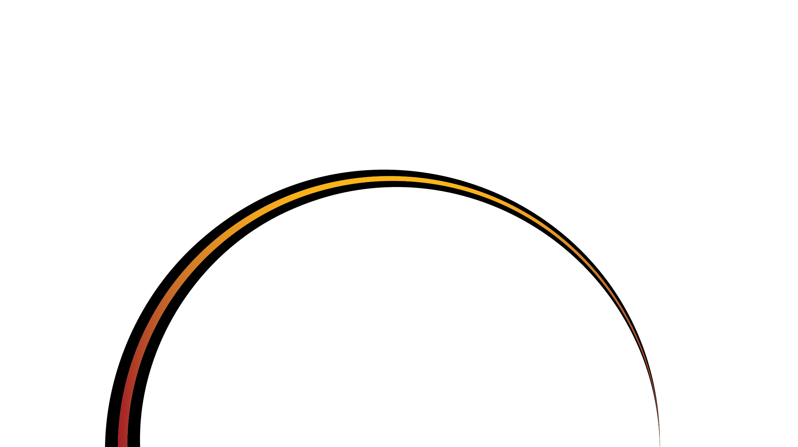
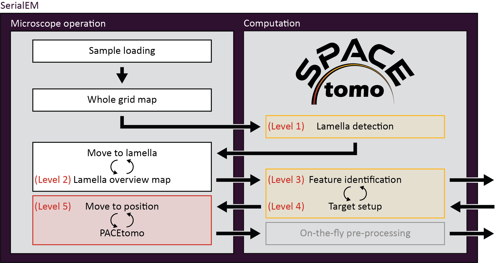

# SPACEtomo

Smart Parallel Automated Cryo Electron tomography (SPACEtomo) is a set of SerialEM and Python scripts to fully automate the cryoET data collection workflow.
Please refer to the [publication](#) for more details.



### Note

For now, the target selection model has been only trained on Yeast data. You can still use SPACEtomo for automated lamella detection and montage collection as well as setting up a dense target pattern covering the whole lamella avoiding ice chunks and cracks.

I plan on training models for a variety of organisms in the future with the help of the community.

## Contents

- [Hardware](#hardware)
- [Requirements](#requirements)
- [Installation](#installation)
- [Usage](#usage)
	- [Preparation](#preparation)
	- [Settings](#settings)
	- [Run](#run)
	- [Output](#output)
	- [External Inference](#external-inference)
- [Video tutorials](#video-tutorials)
- [Troubleshooting](#troubleshooting)
- [Recent changes](#recent-changes)
- [Training Data](#training-data)
- [Future plans](#future-plans)

## Hardware

SPACEtomo has only been tested on a Thermo Scientic Krios equipped with a Gatan K3 direct electron detector at this point although it should also work on other Thermo Scientific intstruments. A recent version of the open-source microscope control software [SerialEM](https://bio3d.colorado.edu/SerialEM/) should be installed and calibrated. It also requires the [PACEtomo](https://github.com/eisfabian/PACEtomo) scripts.

## Requirements

SPACEtomo does not require the installation of any stand-alone software. However, it does require SerialEM 4.1 or higher capable of running Python scripts.

You can run the following lines of code in a SerialEM script window to test if Python is configured correctly:
```python
#!Python
import serialem as sem
sem.OKBox("Python works!")
```
If you get an error message, please consult the [SerialEM website](https://bio3d.colorado.edu/SerialEM/hlp/html/about_scripts.htm#Python) on how to setup Python for SerialEM.

Additionally, you will require several Python modules. I highly recommend using the [miniconda](https://docs.conda.io/projects/miniconda/en/latest/) package manager (you will need network connection).

If everything goes well, you can install all dependencies by downloading the *SPACEenvironment.yaml* file and running the following line the Anaconda Prompt:

    conda env create -f <your path>\SPACEenvironment.yaml

This may take 10-20+ minutes to collect all the packages. If it fails or you are impatient you can install the packages manually step by step.

### Manual setup
<details>
  <summary>Details</summary>

Create a new environment using Python 3.9:

    conda create -n SerialEM_pytorch python=3.9
    conda activate SerialEM_pytorch

The next step is to install the deep learning framework [PyTorch](https://pytorch.org/get-started/locally/). This should be as simple as using the following command but please double check the [PyTorch installation instructions](https://pytorch.org/get-started/locally/) for your system!

    conda install pytorch torchvision pytorch-cuda=11.8 -c pytorch -c nvidia

Let's verify the installaion and check if PyTorch has access to your GPU.

From the command line type:

    python

Then enter:
```python
import torch
torch.cuda.is_available()
```
If the output is not `True`, you have some troubleshooting to do. In my case, for example, I could fix it by updating the nvidia driver on our K3 computer. [Here](https://github.com/pytorch/pytorch/blob/main/RELEASE.md#release-compatibility-matrix) is some info on PyToch and Cuda compatibility and [here](https://docs.nvidia.com/deploy/cuda-compatibility/) some info on Cuda and driver compatibility. Good luck!

The next step is to install the segmentation model [nnU-Net](https://www.nature.com/articles/s41592-020-01008-z):

    pip install nnunetv2

If you run into issues, [here](https://github.com/MIC-DKFZ/nnUNet/blob/master/documentation/installation_instructions.md) are their installation instructions.

Finally, we need [YOLOv8](https://docs.ultralytics.com/) for the lamella detection model:

    pip install ultralytics

</details>

### SerialEM Python path

With that, all dependencies should be ready to go!

To let SerialEM access this environment, we have to adjust the *SerialEM_properties.txt* file to include the Python path to our environment:

    PathToPython	3.9 	<your path>\envs\SerialEM_pytorch


## Installation

To install SPACEtomo, simply unpack the *SPACEtomo.zip* and make note of the path to the folder. This folder contains all scripts but still requires the deep learning models.
Download the [lamella detection model](https://doi.org/10.5281/zenodo.10360489) and the [lamella segmentation model (Yeast)](https://doi.org/10.5281/zenodo.10360540) and extract them into the *SPACEtomo* folder. You should now have a *XXX_yolo8.pt* file and a *model* folder with 5 subfolders in your *SPACEtomo* folder.

Copy the *SPACEtomo.py* script into a SerialEM script window and adjust the *SPACE_DIR* setting to the path of the *SPACEtomo* folder.
```python
SPACE_DIR = "X:\\<your path>\\SPACEtomo"
```

Copy the *SPACEtomo_postAction.py* script into another SerialEM script window.

You also need the [PACEtomo scripts](https://github.com/eisfabian/PACEtomo) (v1.7+) ready and working inside SerialEM.

## Usage

The usage instructions for SPACEtomo assume that [PACEtomo](https://github.com/eisfabian/PACEtomo) is already able to run normally on your setup.

### Preparation

SPACEtomo requires the setup of at least 2 image states in the SerialEM navigator. 

- One image state for whole grid montages (LM maps), at a pixel size <400 nm/px (including binning).
- One Low Dose mode image state with a View magnification for lamella montages (MM maps), ideally at pixel sizes <2.2 nm/px and a defocus offset of 50-100 μm, as well as the desired Record settings for tilt series acquisition. The smaller the beam diameter in Record mode, the more targets can be selected per lamella.

Additionally, an intermediate magnification (IM) might be required to compensate for the coordinate shifts between the low mag and the View mag. This magnification should contain the lamella fully in the FOV when moving the stage to a position on the LM map and it should be fairly well aligned to the View mag.
<details>
	<summary>Details</summary>
When selecting and moving to a point on an LM map, then taking a View image, the selected point will most likely not be in the field of view. Usually, I find that point manually and use the <i>Navigator</i> > <i>Shift to Marker</i> function to adjust the coordinates. 
	
To automate this, SPACEtomo moves to a lamella found on the LM map and takes an image at IM that needs to fully contain the lamella despite the offset. It then runs the same lamella detection model and shifts the coordinates to the newly found lamella. The jump from the IM to the View magnification in your Low Dose image state should be minimal since no further compensation is applied. 
</details>

For optimal results, it is recommended to check or redo the "Mag IS Offsets" calibration for the relevant magnifications.

The magnifications I use are 82x for LM, 580x for IM and 4800x for MM.

If you intend to do a [coma-free alignment](https://bio3d.colorado.edu/SerialEM/hlp/html/menu_focus.htm#hid_focus_coma_by_ctf) and a [coma vs image shift calibration](https://bio3d.colorado.edu/SerialEM/hlp/html/menu_calibration.htm#hid_focustuning_comavs), this should be done prior to running SPACEtomo ideally on a carbon support foil grid.

### Settings

All settings are adjusted in the *SPACEtomo.py* script. 

The most important settings for daily use are the targeting settings:
- The *target_list* includes all classes of the segmentation that are targeted. Examples for all classes can be found [here](img/class_examples.png).
- The *avoid_list* includes all classes that should be avoided.
- The *target_score_threshold* can be adjusted to reduce the number of targets. The score is calculated from the overlap of the camera field of view with the segmented classes. A desired class in the center of the camera is upweighted. Generally, larger targets (e.g. nucleus or cell) are more robust to higher thresholds.
- *sparse_targets* is a useful target selection mode for small targets like mitos or vesicles. If set to *False*, a rigid grid of points is used for initial target selection, which is more suited to large target areas.
- *target_edge* can be used to target the edges of a segmented class. This could be useful for membrane structure studies (e.g. NPCs).
- *penalty_weight*: Factor to downweight the classes of the *avoid_list* relative to the classes of the *target_list*.
- *max_iterations*: Maximum number of iterations for the target setup optimization.
- If you want to add an extra target for the tracking tilt series that does not contain your desired class you can set *extra_tracking* to *True*.

<details>
  <summary>Workflow settings should remain mostly unchanged after being set once. They include the image state settings, aperture control, montage tile overlaps and thresholds.</summary>

- *SPACE_DIR*: Path to the SPACEtomo folder containing the models and scripts.
- *automation_level*: Level 1-5 from only taking the WG map to starting the PACEtomo batch acquisition.
- *plot*: Save plots of intermediate steps (mainly during target selection).
- *aperture_control*: [Does SerialEM have control over the apertures](https://bio3d.colorado.edu/SerialEM/hlp/html/setting_up_serialem.htm#apertures)?
- *objective_aperture*: Size of objective aperture to be inserted when leaving LM.
- *WG_image_state*: Image state index used for LM map
- *MM_image_state*: Image state index used for Low Dose mode tilt series acquisition.
- *WG_offset_via_IM*: Use an intermediate magnification to keep track of lamella when switching image states.
- *IM_mag_index*: The mag index (e.g. 10) of the intermediate magnification or the magnification itself (e.g. 580).
- *MM_padding_factor*: MM maps are padded by this factor compared to the lamella bounding box. This accounts for the coordinates being off center or the bounding box prediction being off.
- *MM_mean_threshold*: If the first View image of a lamella is below this threshold (black), the user will be prompted to manually adjust the position. Set to 0 to avoid a user prompt.
- *WG_montage_overlap*: Overlap between neighboring tiles of the LM map for stitching.
- *MM_montage_overlap*: Overlap between neighboring tiles of the MM map for stitching. Good stitching is especially important here for reliable target selection.
- *WG_detection_threshold*: YOLOv8 confidence threshold for considering a hit a lamella. Raise this value if you have a lot of false positives.
- *max_tilt*: This is the maximum tilt angle during a tilt series. It is used to calculate target spacing without any beam overlap. You can use lower values if you don't care about high angle overlaps and rather have more targets.
- *tolerance*: If two targets are overlapping each other below this threshold, they are moved away from each other. If the overlap is larger than this, one of them is deleted.
  
</details>

The *external_map_dir* setting can be used when running the segmentation inference on an external machine ([see below](#external-inference)).

The *SPACEtomo_config.py* only needs adjustment when updating the deep learning models.

### Run

You can run SPACEtomo at different automation levels. It will stop after reaching the final automation level and will let you manually finish the setup if you desire.



#### Level 1: Lamella identification

* SPACEtomo will load a grid, collect a LM map of the whole grid and identify the positions of lamellae. It will then take another image of a lamella at IM to adjust the stage coordinates accordingly. If you stop at level 1, you can manually move to the identified lamella and decide where you want to collect a montage or select targets using [PACEtomo_selectTargets.py](https://github.com/eisfabian/PACEtomo/).

#### Level 2: Lamella montage collection

* This level includes collection of MM maps of each lamella (optionally include lamella identified as broken). You can then use these maps for manual target selection. Level 2 is organism independent and should be able to be used for any kind of lamella sample.

#### Level 3: Feature identification

* Level 3 includes the subsequent segmentation of the lamella montages for manual inspection. This model is organism specific (only Yeast at time of release) and new models will be released in the future.
* If you intend to collect lamellae exhaustively, you can use the Yeast model and include "lamella" in the first entry of your *target_list*. This allows the target setup to use the organism independent classes (e.g. "black", "white", "ice", etc.) to avoid and set up targets everywhere else on the lamella.

#### Level 4: Target setup

* SPACEtomo will use the generated segmentation to set up targets according to your target selection settings. If you stop at level 4, you will be able to review all selected targets or add additional targets using the [PACEtomo_selectTargets.py](https://github.com/eisfabian/PACEtomo/) script.

#### Level 5: Acquisition

* The highest level of automation will start SerialEM's [Acquire at Items](https://bio3d.colorado.edu/SerialEM/hlp/html/hidd_navacquire.htm) routine. Make sure to set it up accordingly in advance.
* You have to select the [PACEtomo.py](https://github.com/eisfabian/PACEtomo/) script as the *Primary Action* and make sure that the PACEtomo settings in the script have been set appropiately.
* Additionally, you have to set the [SPACEtomo_postAction.py](https://github.com/eisfabian/SPACEtomo/) script as *Run Script after Action*. This script will monitor any finishing lamella segmentations that were not ready for target setup before the PACEtomo acquisition started.

### Output

* SPACEtomo will create a navigator file for each grid. Any kind of montages are saved according to SerialEM settings. Additionally, a plot of detected lamellae with assigned classes and probabilities is saved as *<grid_name>_lamella_detected.png*. 
* All lamella montages are saved as image file rescaled to the pixel size of the segmentation model.
* Segmentations are saved with the suffix *_seg* for each MM map. Each segmentation inference prodcues a *_SPACE.log* file for debugging.
* The *SPACE_runs.txt* and *SPACE_queue.txt* files are necessary to schedule the inference jobs.
* Each lamella produces several plots for the target setup including the targets during each iteration of target position refinement and the final targets on the lamella with the mask overlay in red. Beam shapes at maximum tilt angle are marked by yellow ellipses. Camera fields of view are outlined in red for the tracking target and blue for other targets. The dashed white line represents the tilt axis orientation. Colored dots indicate clustering of positions.


* Tilt series are output as specified by SerialEM and PACEtomo.

### External inference

Depending on your setup, the GPU on the computer running SerialEM might not be powerful enough to analyze MM maps as fast as you collect them. This is not a problem per se since the segmentation inference keeps running in the background during data collection. However, you will need the first segmentation to setup the initial batch of targets, which might cause waiting time in some cases.

To process MM maps on an external machine with a better GPU you can specify an *external_map_dir* in the settings of the [SPACEtomo.py](SPACEtomo.py) script. This directory has to be accessible via the network both by the computer running SerialEM and by the external GPU machine.

The external GPU machine requires the same Python packages as described above and a copy of the SPACEtomo folder. Open the [SPACEtomo_monitor.py](SPACEtomo_monitor.py) script and adjust the *external_map_dir* accordingly.

You can then simply activate the conda environment and run the monitor script:

	conda activate SerialEM_pytorch
 	python <SPACEtomo_dir>/SPACEtomo_monitor.py

The monitor script will check the map dir periodically, queue any MM maps to be analayzed, and save the segmentations to the same directory.

SPACEtomo on the SerialEM computer will keep checking the map dir for new segmentations and setup the targets when appropiate.


## Video Tutorials

Coming as soon as possible!

## Troubleshooting

- In case your lamella montages don't stitch properly, you might need to experiment with the SerialEM montage settings.
- To be continued...

## Recent Changes

Release!

## Future Plans

- Additional tools for manual corrections without interrupting the Run
- Creation of lamella maps with segmented target overlay for manual target picking
- Multi grid SPACEtomo runs
- Segmentation models for Chlamydomonas and eukaryotic cells
- Framework for training your own models
- To be continued... (Let me know if you have wishes or ideas!)

## Training Data

[SPACEtomo training dataset for lamella detection using YOLOv8](https://doi.org/10.5281/zenodo.10360315)

[SPACEtomo training dataset for Yeast lamella map segmentation using nnU-Netv2](https://doi.org/10.5281/zenodo.10360344)

## Acknowledgements

I want to thank all the people who provided training data for the deep learning models:
- Anna Bieber (MPI Martinsried)
- Cristina Capitanio (MPI Martinsried)
- Matthias Pöge (MPI Martinsried)
- Sven Klumpe (MPI Martinsried)
- Gregor Weiss (ETH Zurich)
- Yoshiyuki Fukuda (Tokushima University / University of Tokyo)
