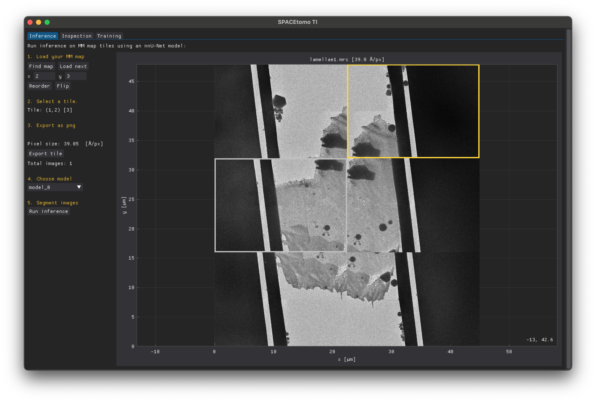
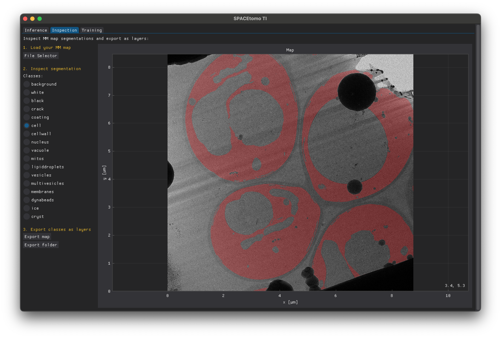
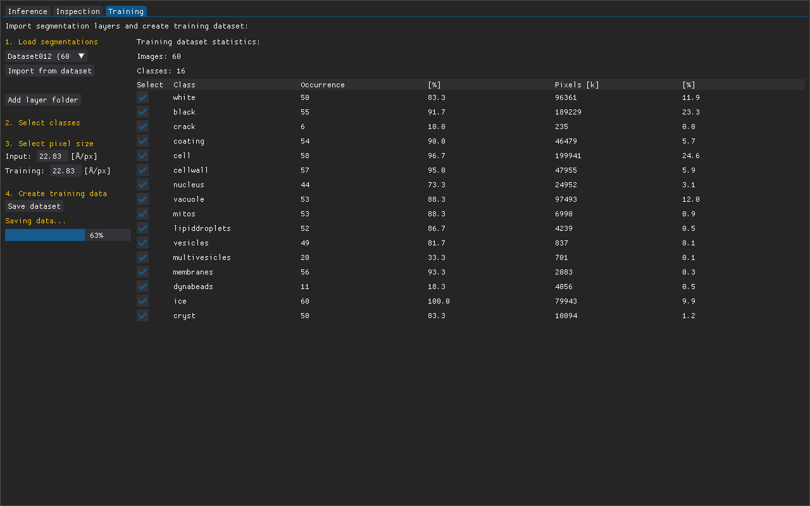
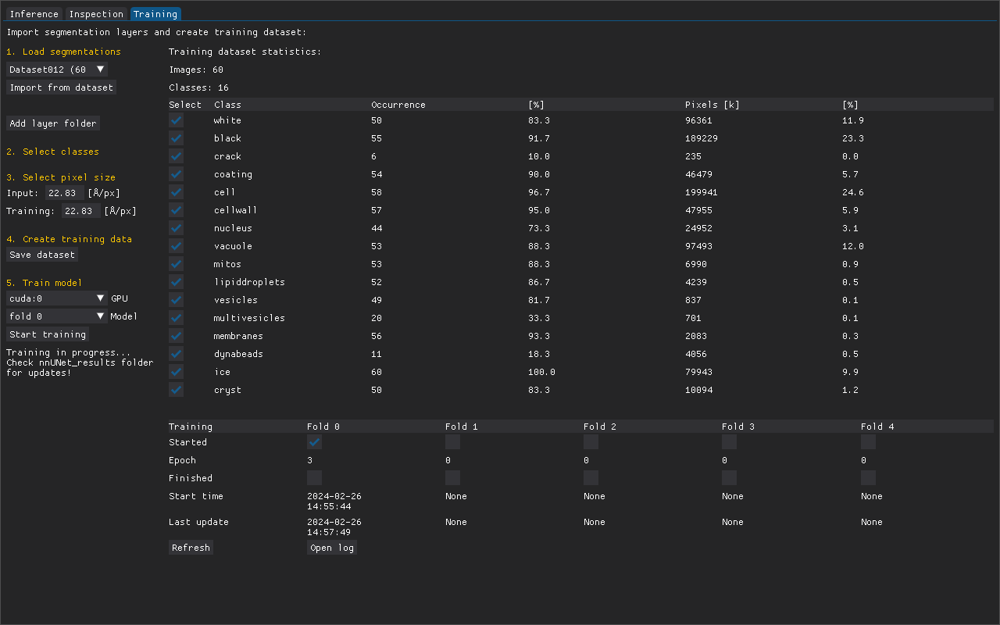

# SPACEtomo Training Interface

The SPACEtomoTI is a GUI for managing lamella segmentation models trained with [nnU-Net](https://github.com/MIC-DKFZ/nnUNet). 


### Basic function overview:
- Inference
  - Import tiles from .mrc montages, preprocess and segment them using existing models
- Inspection
  - Inspect segmentations by overlaying on the map
  - Export segmentations as separate image for each class to be edited as layers in a graphics editor
- Training
  - Import images as classes and create a segmentation
  - Get statistics about class occurence and distribution in your dataset
  - Export and preprocess your training dataset
  - Manage training of a new [5-fold crossvalidated](https://github.com/MIC-DKFZ/nnUNet/blob/1b5a17daedb819b6d0be571598a1384a8a9befc5/documentation/how_to_use_nnunet.md#model-training) nnU-Net model

You will go through these steps iteratively to segment new tiles, correct the segmentations manually and retrain the model with the additional data.

### Note

This is just a GUI combining the scripts I used for my own training process of the Yeast model. It does not include labeling since I used external image editors for that!

[Patrick Cleeve](https://github.com/patrickcleeve2) has implemented [SAM](https://segment-anything.com/) assisted labeling in [OpenFIBSEM](https://github.com/DeMarcoLab/fibsem), which makes labeling from scratch much easier! 
He also has scripts to convert nnU-Net models for assisted labeling. Please check it out!


## Hardware

SPACEtomoTI should run on any computer and most steps don't require a GPU.
For training, however, at least one Nvidia GPU with a minimum of 11 GB of VRAM is necessary.

## Installation

SPACEtomoTI requires the same environment as SPACEtomo. If you have already installed SPACEtomo you have to activate your SPACEtomo environment and install [DearPyGUI](https://github.com/hoffstadt/DearPyGui) simply via pip.

```pip install dearpygui```

You should now be ready to run SPACEtomoTI and see the GUI.

```python SPACEtomo_TI.py```

## How to use

To get started with your own model, collect all lamella montages that you intend to use for training in a folder. Then start SPACEtomoTI in an empty folder.

### Inference



1. Load your MM map
- The first step is to load a lamella montage (.mrc or .map) by clicking "Find map".
- If the lamella map looks scrambled, you can manually adjust the montage dimensions using "Reorder" and "Flip".

2. Select a tile
- You can select a tile by left-clicking on the map. It will be outlined in yellow. Tiles that were previously exported or used in your dataset are outlined in grey.
- Try to choose tiles that include as many of your desired targets as possible.

3. Export as png
- When you export your first tile, you can choose the pixel size at which you want to export your images. This should always match the model you want to use for inference. If you use the SPACEtomo Yeast model, it is 22.83 Å/px.
- You can choose a different pixel size for your own model during the training step.
- The number of total images exported in your current session is displayed.
- Repeat step 1-3 until you have 5-10 images.

4. Choose model
- If no model is found in the folder, you can import a model using "Find model".
- If you don't have any trained model, start with the [SPACEtomo Yeast model](https://zenodo.org/records/10360540) to get you started (it doesn't matter if you have a different organism).

5. Segment images
- "Run inference" will segment all exported images with the chosen model and it might take a few minutes depending on your setup and the number of images. You can follow the progress in the terminal.

### Inspection

Once the segmentation is finished, go to the "Inspection" tab.



1. Load your MM map
- Use "Find Map" to load a map from the "input_X" folder. It will search for the segmentation in the "output_X" folder.
- You can also use Inspection to load whole lamella maps generated by SPACEtomo. It expects the segmentation in the same folder with the suffix *_seg*. You also have to provide the *dataset.json* file of the used model containing the class labels.

2. Inspect segmentation
- You can select any class to show the overlay over the map in red. Currently it is not possible to load two classes at the same time.

3. Export classes as layers
- Each class is exported as an image. A new folder with the map name is created in the segmentation folder.
- You can also export all the other segmentations in the folder without inspecting them by clicken "Export folder".

### Correction (outside of SPACEtomoTI)

You have to manually correct the segmentations of each class using a graphics editing software of your choice. I personally have used Adobe Photoshop together with a Wacom drawing tablet but I will also include some instructions for [GIMP](https://www.gimp.org/), a free open-source software package.

#### Photoshop

- Start Photoshop and use ```File > Scripts > Load Files into Stack...``` to import all class images in the by SPACEtomoTI created folder.
- You can use Photoshop's "Layers" panel to show/hide your classes and start correcting them using any Photoshop tools.
- Don't paint in black or white as these colors will be treated as background when assembling the segmentation in SPACEtomoTI!
- You can lower the opacity to see the map below the segmentation.
- You can delete layers, if the classes are not relevant to your organism.
- You can change the class names by renaming the layers but keep the formatting the same!
- You can add layers if you want to segment additional classes. Keep the name formatting consistent!
- The numbering/order of layers matters! Higher layers (lower number) will overwrite layers beneath in the final segmentation!
- Once you finished your corrections, you can export the layers using ```File > Export > Layers to Files...```.
  - Save to the same folder you imported from!
  - The prefix is irrelevant.
  - Uncheck "Visible Layers Only" unless you made sure to set all relevant Layers to be shown!
  - Choose "PNG-8" as file type.
  - Uncheck "Interlaced" and "Trim Layers"!
 
#### GIMP

- Start GIMP and load images using ```File > Open as Layers...```.
- GIMP loads layers in the opposite order. Use ```Layer > Stack > Reverse Layer Order``` to reverse it.
- For editing, the same rules as the ones for Photoshop apply.
- GIMP has no "Layers to Files feature" but there is a [plugin](https://github.com/kamilburda/gimp-export-layers) you can install.
- With the plugn installed: Use ```File > Export Layers``` to save the images in the same folder.

#### Napari

You can use [Napari](https://napari.org/stable/) for labeling as well as long as the output can be read by SPACEtomoTI.

### Training

Once all your segmentations are corrected and saved, start SPACEtomoTI again, go to the "Training" tab and click "Create new dataset".



1. Load segmentations
- If this is your first training dataset, click "Add layer folder" to select the "output_X" folder containing all your maps with corrected layer images.
- If you already trained your model at least once, you can import the corrected segmentations from the previous dataset and add your new segmentations by clicking "Add layer folder".
- A table containing basic statistics about your dataset is shown on the right.

2. Select classes
- At this stage you can still exclude classes from training by unchecking them in the table.

3. Select pixel size
- This will determine at what pixel size your model will be trained at.
- Larger pixel sizes will perform faster, but some detail in your images might be lost. It will depend on the kind of classes you are aiming for and your organism.
- If your input pixel size is -1, SPACEtomoTI could not infer the pixel size of your loaded data. Please edit it manually!

4. Create training data
- This will rescale your maps and segmentations, export them as nnU-Net dataset and preprocess them for training.

5. Train model
- nnU-Net uses 5-fold crossvalidation to train 5 models (folds) with non-verlapping validation sets. This ensures that every image of your training data is actually used for training. For inference, it uses all 5 models to make an ensamble prediction.
- Here, you can manage the training of these 5 models by choose a device and a fold to start a training job.
- SPACEtomoTI does not know about the GPU utilization (use nvidia-smi, etc.)! Don't try to start more than one training job on the same GPU unless you know it can handle it.
- A training table on the right shows the status of the 5 folds. You have to click the "Refresh" button to get the latest status.
- Training will take about 15-20 hours per fold on an Nvidia RTX 3090.
- You can close the GUI during training.
- When you restart the GUI to manage training, click "Load previous dataset" instead.
- Once all folds are trained, you can use "Export model" to save the model elsewhere ready to be used in SPACEtomo!



## Video Tutorial

Coming as soon as possible!

## Troubleshooting

- If SPACEtomoTI keeps crashing when loading another map, try setting *dynamic_textures* to *True* in the script. (There are some bugs with dearpygui deleting textures from the GPU.)
- To be continued...

## Recent Changes

Release!

## Future Plans

- Options for assisted labeling
- To be continued... (Let me know if you have wishes or ideas!)

